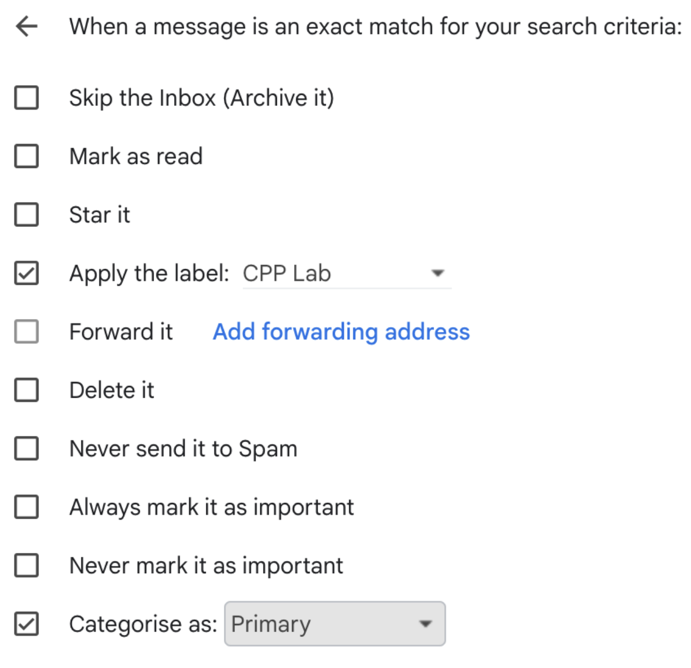
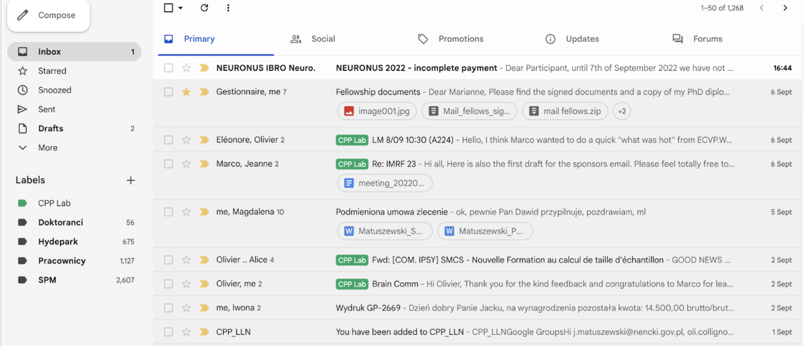

# Online accounts to join
Here is an overview of means of communications that you should be part of. 

## Mailing lists
Normally, you are automatically added to all the following lists, or it's a human process that can require a few days. 
If that is not the case and you hear lab members talk about events you are not aware of, here's a list of mailing lists and who to contact to be added

### CPP_LLN mailing list
- for lab-related information: lab meetings, grants, interesting talks and events, general communications. This email list is a google group, meaning that a message sent to this account will be sent to anyone in the list 
- contact any CPP member 

### Communaute-ipsy
- to be informed about the seminars / talks / events in our department in LLN
- contact Nadine Fraselle

### Neurocs-Ipsy (deprected)

### IoNS members
- to be in the loop of events in IoNS (Institute of Neuroscience in Woluwe)
- contact Cathy Friand

!!! TIP
    **Setup Gmail labels**

    If you want to have emails from the CPP_LLN mailing list clearly marked in your PRIMARY tab on GMail (and potentially other email platforms too), follow these simple steps: 

    - create a label (e.g. CPP_LLN or CPP_LLN_group)
    - go to your global gmail settings (cog wheel, upper right) > See all settings > Filters and blocked addresses
    - create a new filter (bottom of the page) 
      * to: cpp_lln@googlegroups.com 
      * from: oli.collignon@gmail.com
    - create filter > choose "Apply to the label" and select CPP Lab, and "Categorise as: Primary" (see example)

     

    This would be an exemplary result with lab-related information marked with a pretty label, always on your primary tab:

     

## Github
We use [Github](https://github.com/) to store and share all relevant code for our experiments. 
For this reason, create an account and ask to be added to the [CPP github organization](https://github.com/cpp-lln-lab) as a member. 
On the Lab account, you can find templates for data management and analyses, in addition to bidspm and other resources. 

## Discord
We mainly use [Discord](https://discord.com/) to communicate among us. 
You can downaload the application, create a free acount and ask to be added to the CPP Discord server (Link TBD)

## Google Drive
Most of the files we share (without sensitive data) are shared through a [Google Drive folder]([link](https://drive.google.com/drive/folders/0B_uzjo71y59FOVNXVlNRN1k2c1k?resourcekey=0-3qpicNZjpKuxfV71jyIhlg)) to which you cna request access.
Here, you'll find most of the information about lab admin. 

## Teams
We mostly use Teams to host the weekly lab meetings in hybrid format, meaning that if you cannot make it in person you can still join online.
Make sure to ask in the lab to be added to the CPP Team space. 

## Others

### ORCID
For science communication purposes, we use [ORCID](https://info.orcid.org/researchers/) to link our publications together.
This will be used in the latest stages of a paper, but it's important to have an account already.

### Google Scholar 
Similarly to ORCID, [Google Scholar](https://scholar.google.com/) allows other researchers to quickly access your studies. 
Making an account will increase the visibility of your output