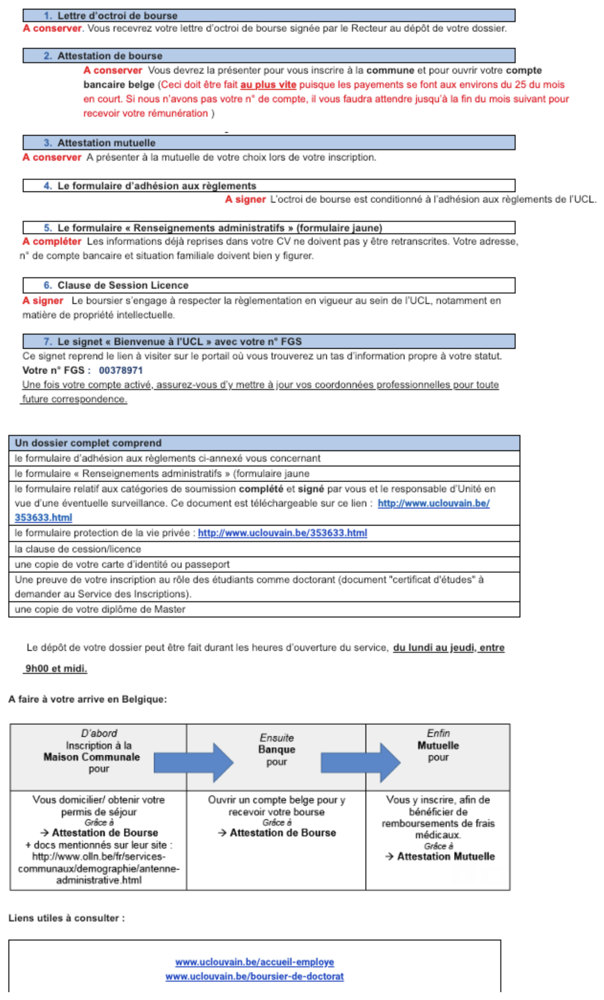

# Welcome section

If you are reading this document it means that you will join the CPP-lab soon: WELCOME!! To make your arrival as smooth as possible we created this “welcome guide” with the most important information about admin and practical issues.
 
CPP-lab: [https://cpplab.be/](https://cpplab.be/)

Our lab is divided into 2 different locations: Université catholique de Louvain (Louvain-la-Neuve, Belgium) and University of Trento (Trento-Italy).

To find out who is working at the CPP-lab, please see: https://cpplab.be/peoples/

Do not hesitate to contact us if you have any question or if you need help!

University:

PRACTICAL INFO [here](https://www.uclouvain.be/en-326638.html)

HOW TO ARRIVE [here](http://www.uclouvain.be/en-acces-lln.html)
 
HOW TO GET AROUND [here](http://www.uclouvain.be/en-239559.html)

## Registration 

### Common to all cases

There are different procedures to follow according to your position at UCL.

The following figure relates to your “bourse”.

  

More useful info about admin. available here:
https://www.uclouvain.be/en-8109.html
http://www.uclouvain.be/364256.html

International students:  - any use of this?
https://uclouvain.be/en/study/international-bachelor-master-doctorate.html

You may still have practical questions about living in Belgium or working at UCLouvain. The Louvain Welcome Desk (LWD) is there to help you ! The LWD is UCLouvain’s Euraxess service center for researchers in mobility. This hub, which takes the form of a virtual contact point (email address), is dedicated to mobility and ensures that any question emanating from researchers in mobility at UCLouvain will be answered, whatever the service in charge ! We therefore are at the crossroad between Human Ressources, the International Relations Office, the Enrolment Office, etc ; thus, creating an efficient ecosystem to welcome you.

On the one hand, please feel free to visit the [Louvain Welcome Desk website](https://uclouvain.be/en/research/welcome-desk), which also covers the administrative aspects of your research stay.
Besides, the LWD organizes welcome sessions where we present you the different aspects of life in UCLouvain. There are three sessions each year (October, January, June). The next one will occur 30 January 2025, both in Louvain-la-Neuve (location to be further confirmed) and remotely by Teams (from 9.30 to 11.30 am). If interested, you can already register [here](https://forms.office.com/Pages/ResponsePage.aspx?id=1JCwei76z068fEEntNWC7FkRzUV36QNFpcZ5vygrAtdUQUVRQzFKSUpKRUdFTU4wTEYySTM4N0dDWC4u).
 
### Erasmus+ Mobility for Traineeship
In order to be enrolled and to received the student card (which is useful for many discounts such as mensa, language courses, sport courses) you should go to the registration office at Halles Universitarie (Place de l'Université 1, 1348 Louvain-la-Neuve),  with the following documents:

-learning agreement;
-registration form (provided by the registration office in Halles Universitarie signed by Michele Piquart, C008, Place Cardinal Mercier 10). 
-l’analyse de risque (provided by Michele Piquart, michele.piquart@uclouvain.be  )
-ID/passport (copy)

If you have any question, the contact name for Erasmus in the IPSY faculty in Louvain-la-Neuve is Michèle Piquart (michele.piquart@uclouvain.be).

### Visiting PhD student
At least one month before  (better if 2/3), send an email to Nadine Fraselle (nadine.fraselle@uclouvain.be), with Olivier Collignon in cc, with the following information:
-       Your name, surname, date of arrival, duration of your internship;
-       Copy of your passport or ID;
-       CV;
-       If the duration of your internship is 3 months or less : “Formulaire d'accueil d'un chercheur visiteur EN.doc’”
-       If the duration of your internship is more than 3 months: “Collaborateur scientifique - Formulaire.pdf”
 
 
Once the faculty has approved your request they will get an Global UcL ID (hopefully before your arrival at UcL). With the ID you can go to Yolande Nivaille (she does not speak english, ask help to a French speaker for that) and ask her for the UcL email address (if you want it), for the access to the printer and for the access card.
 
If you are Erasmus PhD student: the contact name for Erasmus in the IPSY faculty in Louvain-la-Neuve is Michèle Piquart (michele.piquart@uclouvain.be).
 
### Future PhD student at UCL

General link for anything related to doing a Phd at UCLouvain: 
- https://uclouvain.be/en/research/valodoc
- https://uclouvain.be/en/study/welcome-activities-international-students.html

If from abroad:

Information for international researchers at UCLouvain <welcome-researcher@uclouvain.be>

 https://uclouvain.be/en/research/welcome-desk
https://uclouvain.be/en/study/international-welcome-guide.html

### FAQ:
-  https://uclouvain.be/en/study/questions-frequemment-posees.html
- https://uclouvain.be/en/study/international-students.html

There are several interconnected procedures to follow to register as a PhD student (and therefore receive your salary):
1. First (before contacting the respective doctoral school) the prospective phd student needs to contact the enrollment department of UCLouvain (https://uclouvain.be/en/study/inscriptions) to guarantee the equivalence of diploma (and any other question); more precisely that the master diploma allows inscription at UCLouvain as a Phd student (eg master 120). Follow this link for the service of inscription either at louvain-la-neuve (doctoral school ipsy) or wolluwe (doctoral school science biomedical): https://uclouvain.be/en/study/inscriptions/contacts.html
2. get your PhD proposal approved by the “commission doctoral” (CDD ; secretary is Martine JANSSENS). The CDD meets once a month so make sure to time things appropriately.
3. get enrolled at UCL (this requires to get the green light from B) to be finalized but you can start this ASAP anyway) (person to get in touch with: Mila Mihaylova ; Service du personnel, Place de l’universite if you enroll at Doctoral school in psychology; )
4. for our payments (bourse / scholarship) you might need to bring some additional papers (most of them should be in the annexe.zip in CPP-Lab_SharedFolder(LLN)\WelcomeinBelgium) to Lorraine Jacob (Service du personnel, Place de l’universite). This will require a proof of enrollment that you get from B.

For 2 see : formulaire - PhD students or to be students at the Psychology department
https://uclouvain.be/fr/facultes/psp/formulaires.html

For 1 and 3 see :
Enrolling/inscription at the respective doctoral school. (FYI: this enrollment is mandatory at the beginning of every academic year.) https://uclouvain.be/en/study/inscriptions/
Once the online registration is done, you will have to send the application by post or personally submit (whichever is suitable)  at the inscription office. https://uclouvain.be/en/study/inscriptions/university-s-enrolment-office-at-louvain-la-neuve.html
Make sure to have the documents ready(in general): 1. all certificates and/or diplomas of past 10 years 
2. Funding(if applicable) related documents 3) Personal information file. 
It's important to know that inscription at the doctoral School and any probable Funding Application are two separate entities but dependent on each other. For any funding application enrolment at the Doctoral School is Mandatory. So keep an eye on the deadlines.

### Public transportation
- If you need to use public transport to get to UCL, the university will cover the cost of your travel subscription if you have FNRS or FSR grant (“Frais de déplacement” - http://www.uclouvain.be/357050.html ). Note that not all the grants cover the cost of travel subscription (e.g., WBI grant). Make sure you know in advance which is your particular case.
More information can be found on: https://intranet.uclouvain.be/fr/myucl/travailler/frais-de-deplacements-domicile-lieu-de-travail-0-1.html
The dedicated email address to ask questions about it is: remuneration@uclouvain.be
-	It will typically be either the train SNCB network or the bus TEC network. Best to ask a French speaking lab member to help you with this. Normally, the university will automatically get you a year-subscription, so you may encounter problems if you have to change the type of subscription in the middle of the year (for instance, changing the train season ticket to a bus season ticket).
 	 
### Post-doc

Fellowships
- Personal grant managed by the university (Includes FNRS, FSR, MCurie...)
  - Contact : bourses.docpostdoc@uclouvain.be
  - More direct contact: Lorraine Jacob <lorraine.jacob@uclouvain.be>
  - Things should be pretty automatic but write the contact above to be sure everything is in order in terms of registration to the university.
  - Contact Nadine Fraselle (IPSY - your main affiliation) and Cathy Friand (IoNS - you are also affected in Ions) to mention the start/end date of your contract and source of finance, ideally before you start.
- Fellowship paid by a Grant from Olivier (or else; typically for people coming from abroad). 
  - Make sure Olivier signed your contract BEFORE YOU ARRIVE IN BELGIUM by sending the appropriate document along with your CV and a copy of your passport/CV.
  - Contact : bourses.docpostdoc@uclouvain.be
  - Things should be pretty automatic but write the contact above to be sure everything is in order in terms of registration to the university.
  - Contact Nadine Fraselle (IPSY - your main affiliation) and Cathy Friand (IoNS - you are also affected in Ions) to mention the start/end date of your contract and source of finance, ideally before you start.
- Fellowship not managed by UCLouvain (eg paid by another country or by WBI)
  - Since you are a fellow not paid by UCLouvain, the U. does not have you in the system "automatically" and you have to register as a "Visiting researcher" (the document is in this CPP folder. 
  - Write: Gestion contrats chercheurs <contrats-chercheurs@uclouvain.be>
  - Contact Nadine Fraselle (IPSY - your main affiliation) and Cathy Friand (IoNS - you are also affected in Ions) to mention the start/end date of your contract and source of finance, ideally before you start.
- Work Contract
  - Make sure Olivier signed your contract BEFORE YOU ARRIVE IN BELGIUM by sending the appropriate document along with your CV and a copy of your passport/CV.
  - Contact :contrats-chercheurs@uclouvain.be
  - More direct contact: sara.wilmet@uclouvain.be
  - Things should be pretty automatic but write the contact above to be sure everything is in order in terms of registration to the university.
  - Contact Nadine Fraselle (IPSY - your main affiliation) and Cathy Friand (IoNS - you are also affected in Ions) to mention the start/end date of your contract and source of finance, ideally before you start.

### Relevant information for people coming from outside the EU 
